# Bootloader
## 内存初始化
Frame Allocator 的实现依赖一个*recycled* 的数组来保存被回收的页面，在空时进行线性分配。
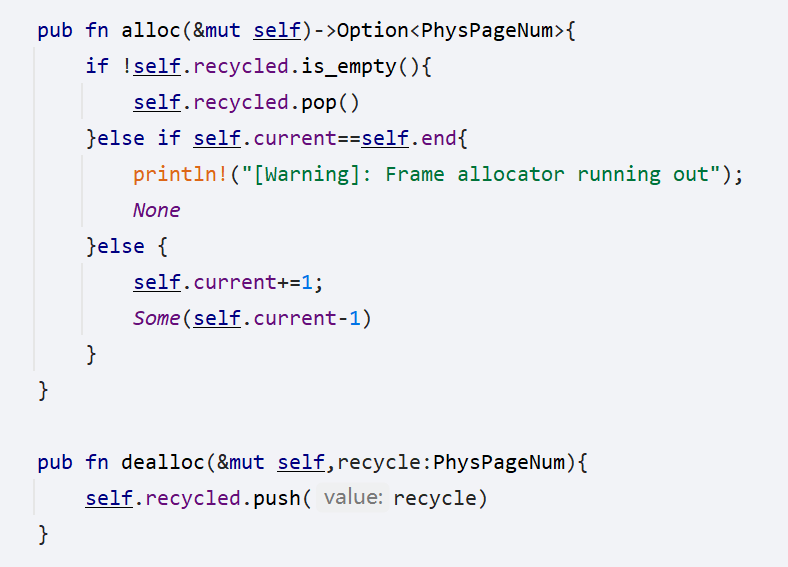
其初始化时使用kernel末端到MEMORYEND 所有的虚拟地址空间
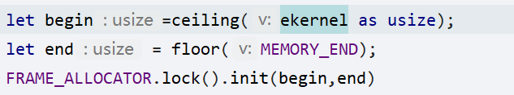
## 内存管理
Page table 的初始化就是先从Frame Allocator当中申请一个页面作为基地址。
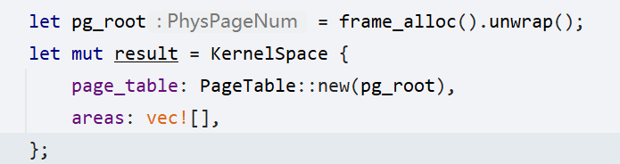
建立映射和主动查找方式基本如下
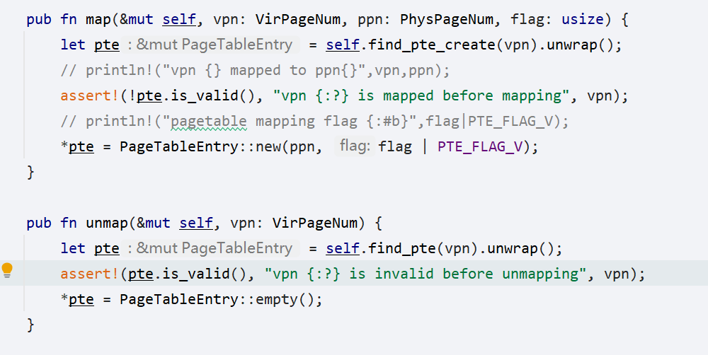
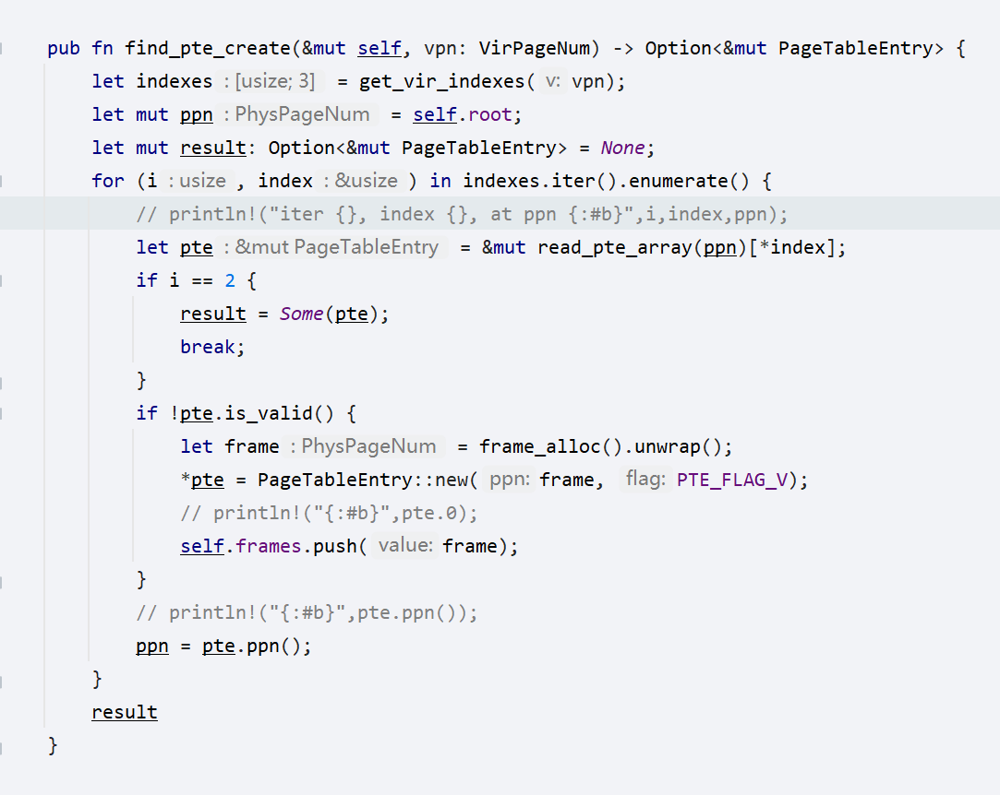
Buddy Allocator实现了一个基于内存空间的链表，并利用经典伙伴算法实现了分配和合并，由于OS内部的数据结构依赖该BuddyAllocator分配，因此该Allocator可行
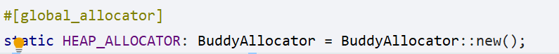

## IO
IO基于UART内存映射地址，并使用一个队列来实现维护顺序。用户态可以执行shell印证其可用性
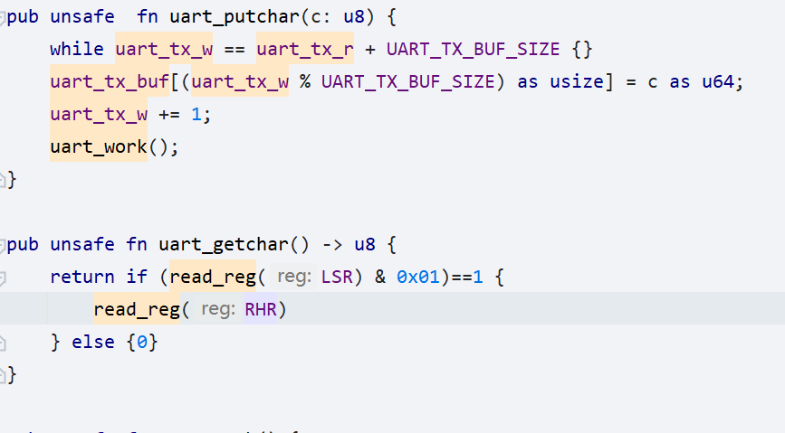

## 进程加载
进程加载依赖ELFPARSER的得到内部数据段信息，并向自身进程的页表建立该部分的映射和为进程分配内核栈和用户栈空间，并且设置TrapContext等Trap信息。
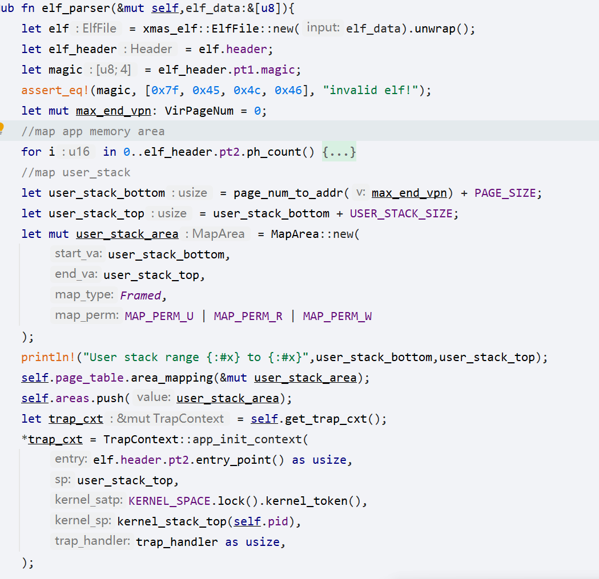

## 调度
使用很非常简单循环队列维护待执行应用
上下文切换依赖简单的Context保存和写入
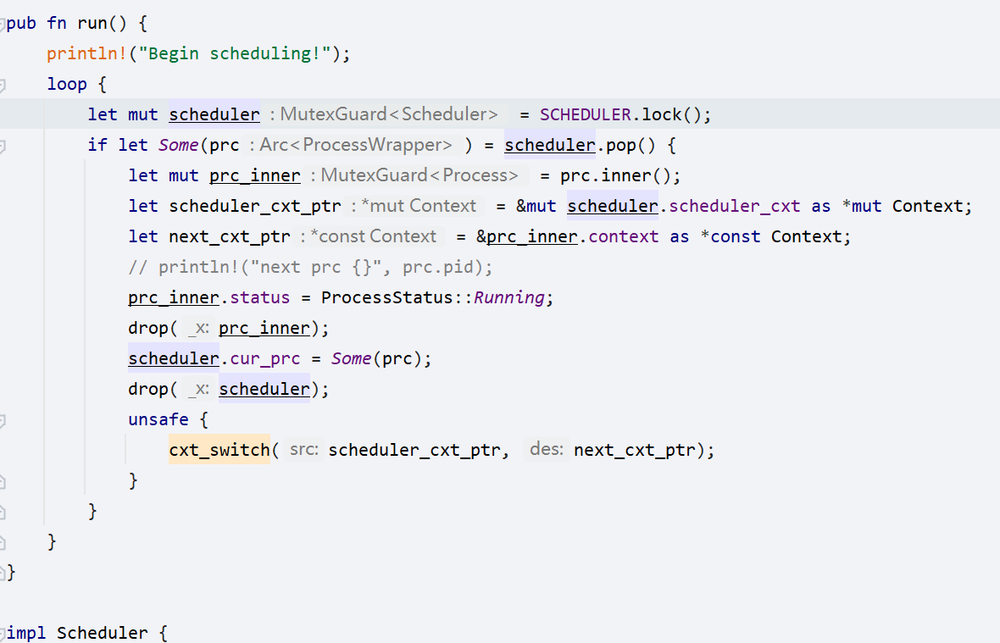

## 中断
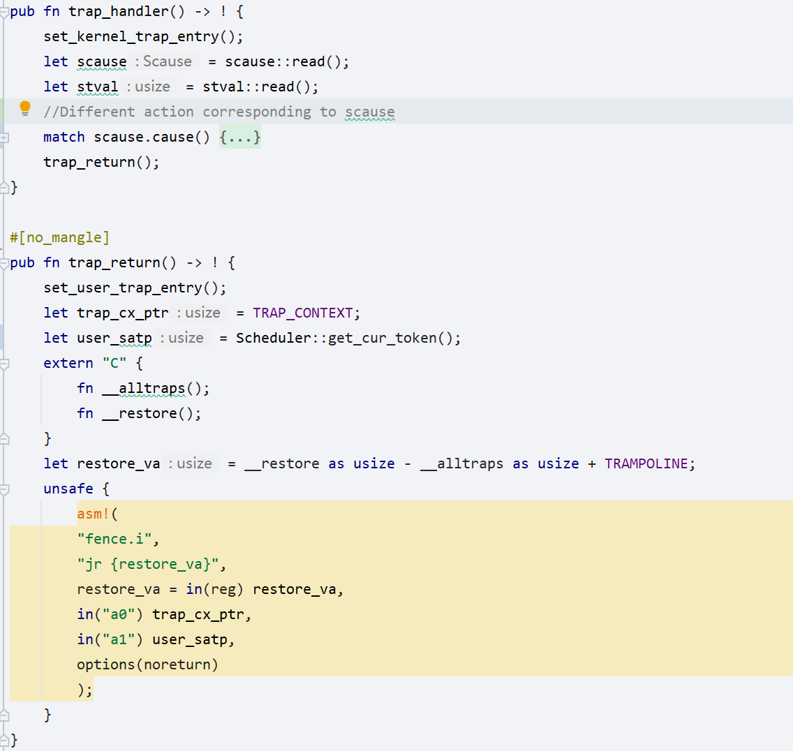

## 用户态
实现了用户态的shell， 在使用lOSe时会自动启动

## 关机
在shell中输入shutdown即可关机。实现如下
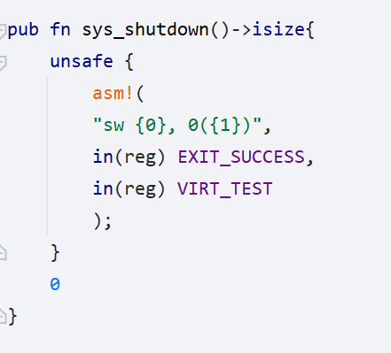

## 自旋锁
自旋锁设计包含锁本体和守护锁（绕过rust检查），实现本身依赖rust::core当中的原子操作，并通过实现Mutex<T> 实现了全局的静态可变对象
